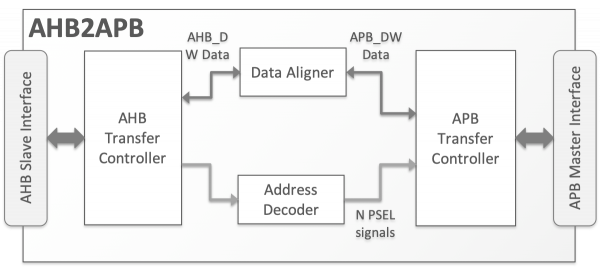
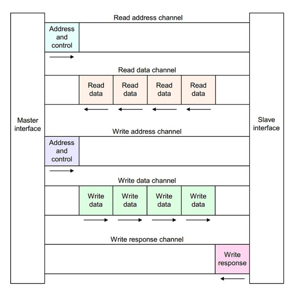
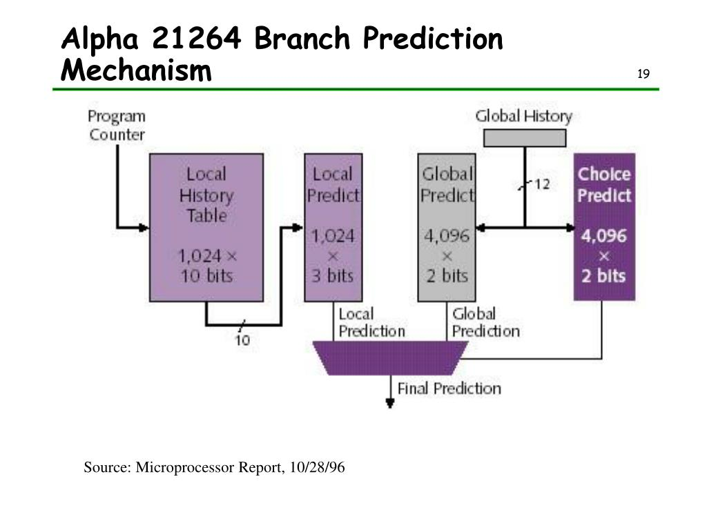
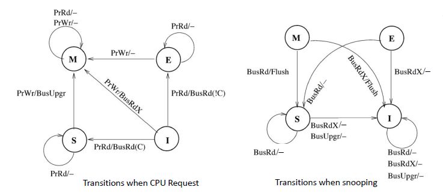
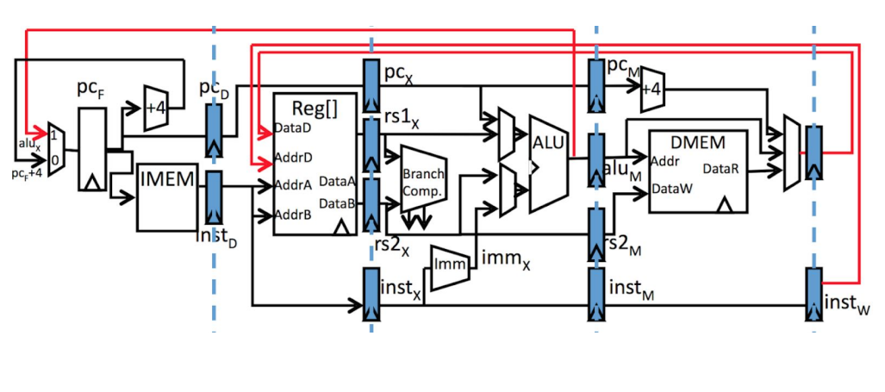
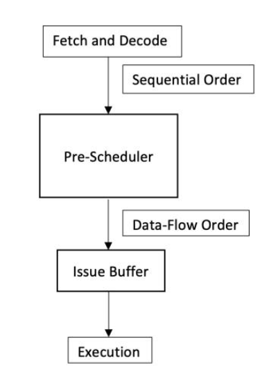
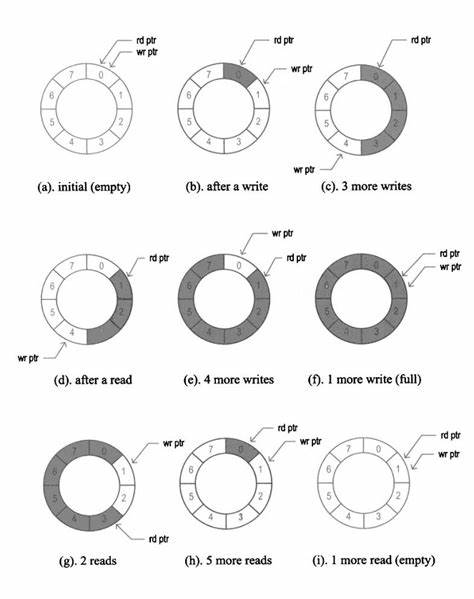
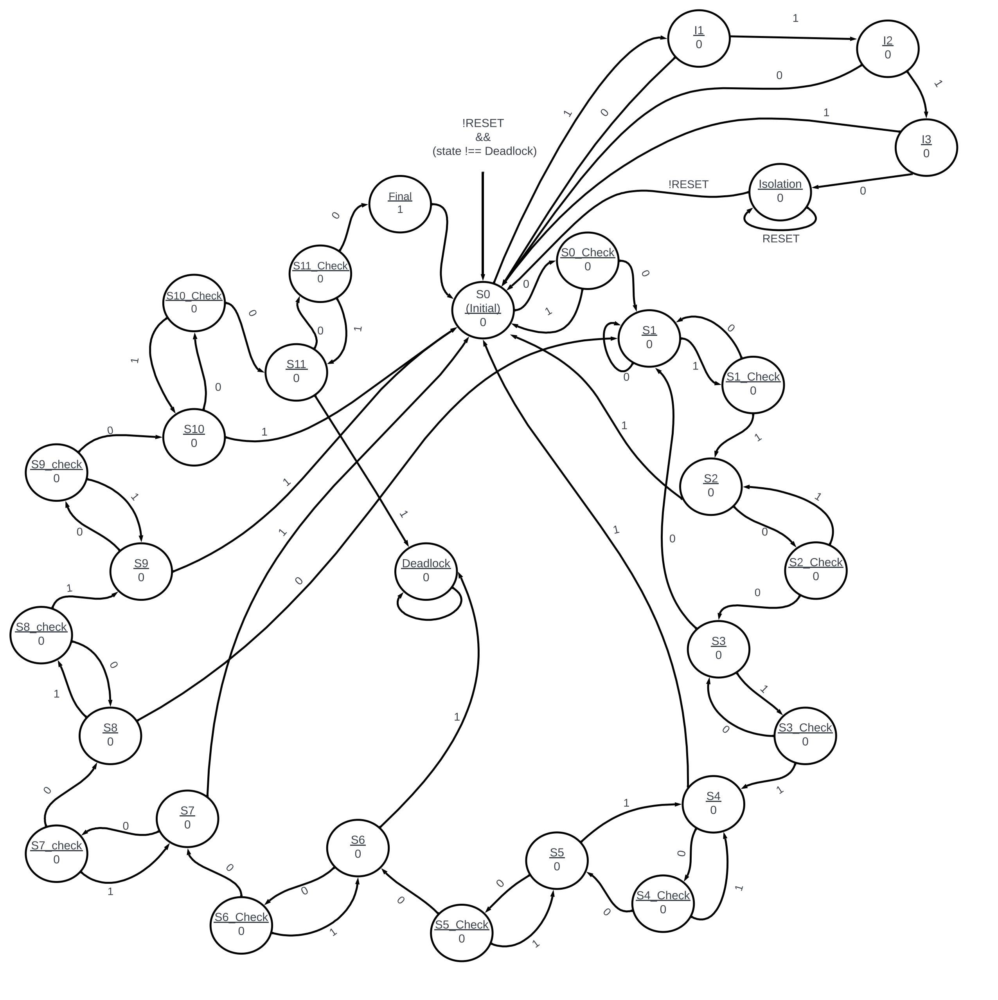
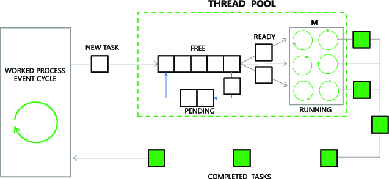

# Portfolio

### Summary:

SoC Logic Design Engineer at Intel Corporation. Experienced VLSI Engineer (4+ years) in IP Design, Design Verification (DV), Post Silicon Validation, and Design for Testability (DFT).

Master of Science Degree in Electrical And Computer Engineering from Portland State University with 3.89/4 GPA. 

Proficient in  hardware description languages like Verilog, System Verilog, VHDL and UVM Methodology, experience with programming languages including Python, C++, PERL and Makefiles with expertise in RTL, testbench and Testcase Coding and Debugging. 

Strongly skilled in project development, leadership, mentorship, and collaboration.

Interests: Photography, Hiking, Movies, Poetry.

Email: <a href="mailto:abhigna@pdx.edu">abhigna@pdx.edu</a>

Previous Work: [GitHub](https://github.com/abhigna97)

Professional Network: [LinkedIn](https://www.linkedin.com/in/abhigna-bheemineni-6a055a132/)

---

### Technical Skills:
- **HDL:** VHDL, Verilog, System Verilog, UVM(Methodology)
- **PROGRAMMING LANGUAGES:** C, C++, Java, Python, PERL, TCL scripting, Linux Commands, Makefiles.
- **TOOLS:** Quartus Prime, Questa Sim, Synopsys DC, FC, VCS, Verdi, Spyglass, Xilinx ISE, Vivado, Cadence Virtuoso, MATLAB, Tessent.
- **PROTOCOLS:** Advanced Microcontroller Bus Architecture - APB, AHB, AXI, CHI, and MSI, MESI(F), MOESIF, Ethernet, 5G NR, PCIe.
- **CONCEPTS:** RTL Design & Debug, Test Bench Coding, Microarchitecture, Testcase Writing, Functional/Code Coverage, Assertion Based Verification, Constrained Random Coverage Driven Verification (CR-CDV), STA, DFT, MBIST, FBIST, ATPG, Cell Aware ATPG, ASIC/FPGA Design, Memory, DDR, Cache Coherence, MIPS, RISC-V ISA, CMOS Design, Formal Verification, Emulation, Gate Level Simulation (GLS).

---

### Education:
**Master of Science, Electrical and Computer Engineering (September 2022 – June 2024)** 
Portland State University, Portland, OR, USA. GPA : 3.89

**Courses:** Microprocessor System Design, Computer Architecture, ASIC Modelling & Synthesis, System Verilog, Pre-Si Validation, Digital IC Design, Formal Verification.

**Diploma, RTL Design Verification (August 2018 – January 2019)**  
Maven Silicon Private Limited, Bengaluru, India.

**Bachlor of Technology, Electronics and Communication Engineering (September 2014 – May 2018)**  
Vignan's Lara Institute of Technology & Science, Vadlamudi, India. GPA : 3.75

---

### Experience:

#### SoC Logic Design Engineer, Foundry Services, Intel Corporation, Folsom, CA. (July 2024 – Present)
- RTL Design for Debug Subsystem IP for Server Class SoC (July 2024 – Present)
    - Written RTL Design for Debug Security Shim to translate the security signals between sourced IPs and Intel IP.
    - Resolved debug for JIRA Tickets from the Verification team.
    - Microarchitecture diagrams design using drawio tool.
    - Functional Simulations using Synopsys VCS, and Synthesis using Fusion Compiler.

#### Design For Test Engineer Graduate Intern, Intel Corporation, Austin, TX. (July 2023 – June 2024)
- Cell Aware ATPG, MBIST Validation and Foveros BIST (July 2023 – January 2024)
    - Handled Scan Insertion, MBIST and CA ATPG Test Runs and worked on FBIST 5.0 for 2.5D/3D Interconnect Testing.
    - Handled MINT (Intel's Wrapper around Tessent MBIST) for an MBIST Validation Project.
- RTL Restructuring using Synopsys RTL A (January 2024 - June 2024)
    - Handled restructuring of RTL to enable the team with support for utilizing legacy design while migrating to new work flow.

#### Design Verification Engineer, Bitsilica Private Limited (Intel contractor), India. (February 2020 – September 2022)
- Post Silicon Validation Regression Test Suite (June 2021- September 2022)
    - Handled Lab Setup Bring up for silicon from A0 testing to tape-out. Developed Python Based Regression Test Suite for Post Silicon Validation Team at Intel.    Worked on Python/TCL scripting.
- Polar IP for 5G NR Design using System Verilog (March 2021 – January 2022)
    - Worked on Microarchitecture, RTL Design, Synthesis, Static Timing Analysis, Assertions, Functional Coverage, Code Coverage for the IP consisting of Encoder, Decoder interfaced with AXI-4 Lite for configuring register space, and AXI-Stream for streaming I/O.
- Ethernet PCS and PMA Sublayers Design and Verification using System Verilog, UVM (November 2020 – March 2021)
    - Verified the Design with UVM Class Based Testbench with Constraint based Coverage Driven Test plan including assertions for the Physical Coding sublayer, a networking protocol sublayer IP in 1 Gigabit ethernet Standard with 8B/10B encoding scheme.

#### SoC Design Verification Intern, Insemi Technology Services (AMD Contractor), Bengaluru, India. (November 2019 – January 2020)
- APB 2 AHB Bridge Design and Verification using System Verilog, UVM (November 2019 – January 2020)
    - The Design of AHB Slave which converts AHB Transactions to APB transactions using pipelined AHB slave interface for bursts.

   
   
AHB To APB Bus Bridge

#### IP Design Verification Intern, Maven Silicon, Bengaluru, India. (March 2019 – July 2019)
- AXI 4 Master Slave Design and Verification using System Verilog, UVM (March 2019 – July 2019)
    - The design of Interconnect for IP blocks, peripherals, and other components on SoC to facilitate High Speed Data Transfer.
      

  

---

### Academic Projects:

#### [Tournament Branch Predictor Design and Verification for Alpha 21264 Microprocessor in System Verilog](https://github.com/abhigna97/Alpha-21264-Microprocessor-Tournament-Branch-Predictor-using-System-Verilog) 
- Design employs both Local and Global Branch Prediction History, a Choice Prediction scheme to choose from either of two.
- Verified the Design Using Assertion Based, Exhaustive, Constrained Random Testing. Optimal Functional & Code coverage.
      

  

#### [Last Level Cache Design and Verification in System Verilog](https://github.com/abhigna97/Last-Level-Cache-design-using-System-Verilog)
- Design employs MESI Cache coherence protocol and Pseudo LRU Replacement Policy in a shared memory configuration.
- Verified the Design with Extensive Testbench and Test plan involving corner cases for respective Cache policies for L1 and L2.
      

  

#### [RISC-V RV32I RV32M ISA Simulator Design and Verification in C/C++](https://github.com/abhigna97/RISCV-RV32I-RV32M-ISA-Simulator-using-C-) 
- The Simulator supports Arithmetic, Logical, Jump, Memory Instructions using the 6 instruction encoding formats available.
- Verified the Design with directed test plan involving writing C & Assembly Language programs (RISCV GNU Cross Compiler).
      

  

#### [Data Flow Preschedule Buffer for Out of Order Superscalar Processor in C/C++](https://github.com/abhigna97/Preschedule-Buffer-for-Out-of-order-Superscalar-processors) 
- Developed a program to Reorder instructions before they enter issue buffer by eliminating data dependencies.
      

  

#### [Verification of Circular buffer using SystemVerilog Class Based Testbench](https://github.com/abhigna97/Verification-of-Circular-buffer-using-SystemVerilog-Class-based-TestBench)
- Developed a testbench, testcases in SystemVerilog for verifying circular buffer RTL including pointers, full and empty signals.
      

  

#### [Design and Formal Verification of a Sequence Detector FSM for Enhanced Security Applications](https://github.com/abhigna97/Design-and-Formal-Verification-of-a-Sequence-Detector-FSM-for-Enhanced-Security-Applications)
- Created secure sequence detector with deadlock/isolation states for robust security.
- Performed formal verification using Synopsys VC Formal suite, ensuring correctness.
- Crafted noise mitigation strategy, ensuring system stability and accuracy.
      

  

#### [A Survey on Dynamic Thread Pool Management Techniques](https://github.com/abhigna97/A-Survey-on-Dynamic-Thread-Pool-Management-Techniques)
- Dynamic Thread Pool Management (DTPM) techniques are essential for optimizing the performance and resource utilization of concurrent and parallel computing systems.
-  The paper provides insights into the principles and practical implications of DTPM techniques, identifying open research challenges and future exploration avenues.
-  The survey delves into three research papers focusing on thread optimization techniques, performance studies, and dynamic optimization designs for thread pool systems.
      

  

---
Feel free to reach out to discuss collaboration opportunities or for further details on any projects or experiences.
Take a look at my work on [GitHub](https://github.com/abhigna97)
Here's my [LinkedIn](https://www.linkedin.com/in/abhigna-bheemineni-6a055a132/)
Email: <a href="mailto:abhigna@pdx.edu">abhigna@pdx.edu</a>

